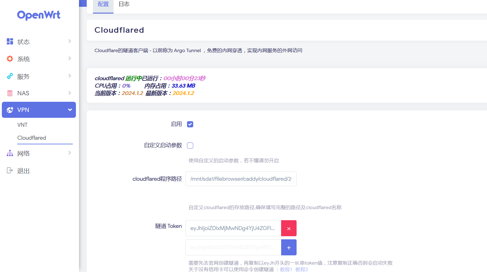
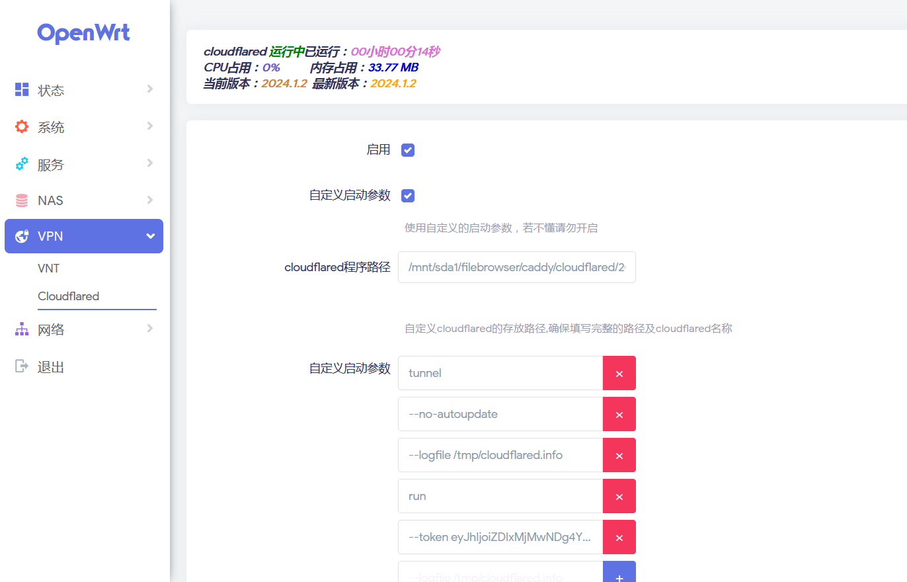
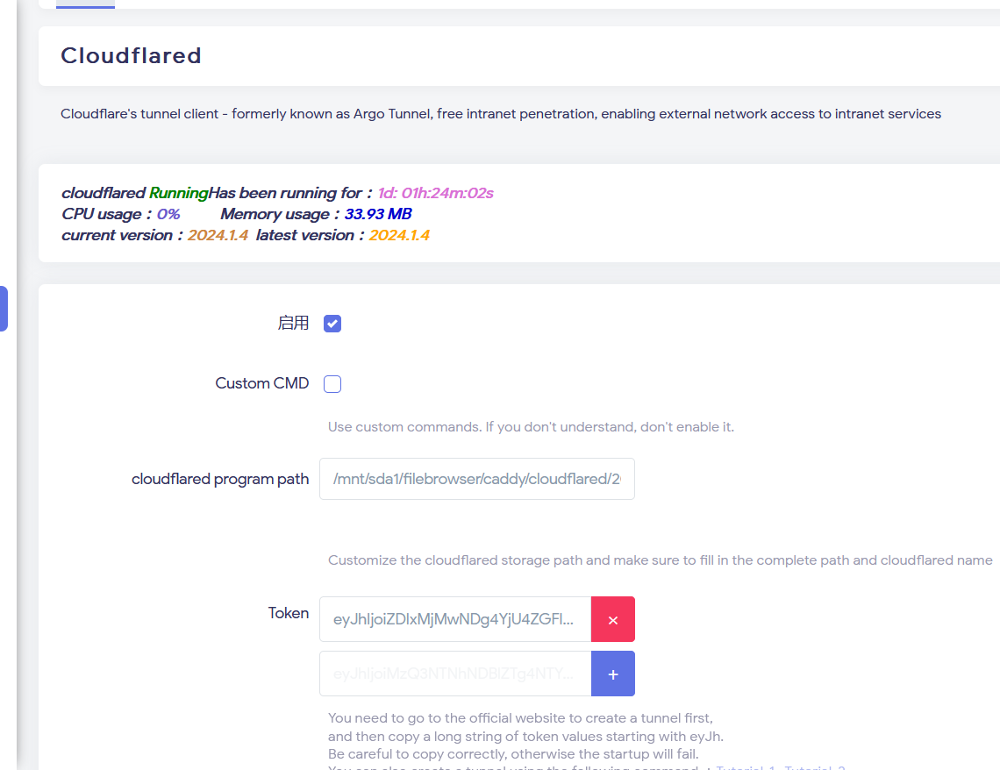

# luci-app-cloudflared

<a href="https://github.com/lmq8267/luci-app-cloudflared/releases">
<a href="https://github.com/lmq8267/luci-app-cloudflared/graphs/contributors">
<a href="https://github.com/lmq8267/luci-app-cloudflared/releases/">
<a href="https://github.com/lmq8267/luci-app-cloudflared/issues">
<a href="https://github.com/lmq8267/luci-app-cloudflared/discussions">
<a href="GitHub repo size">
<a href="https://github.com/lmq8267/luci-app-cloudflared/actions?query=workflow%3ABuild">

项目地址：https://github.com/cloudflare/cloudflared

没有添加cloudflared二进制程序，需要自己下载对应cpu架构的二进制程序手动上传至路由器，然后填写对应的程序路径。

### UI预览 ###
普通启动

-----------------------------------
自定义参数启动

English

